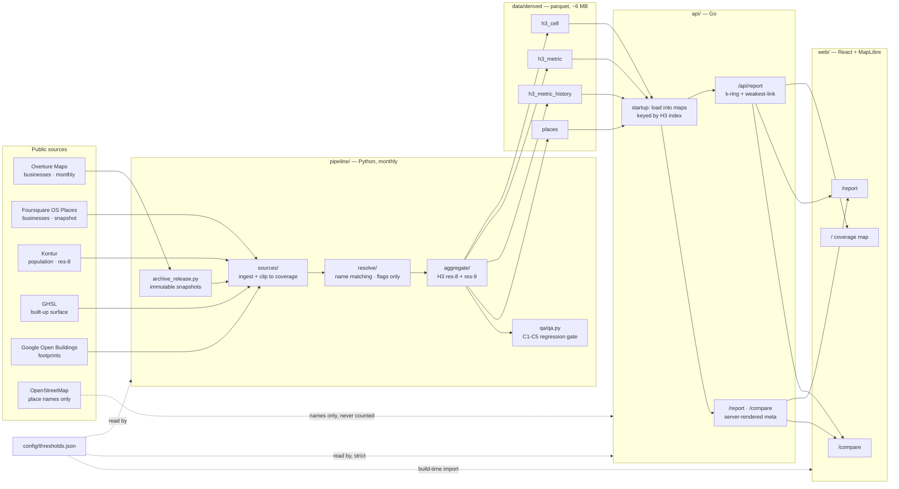
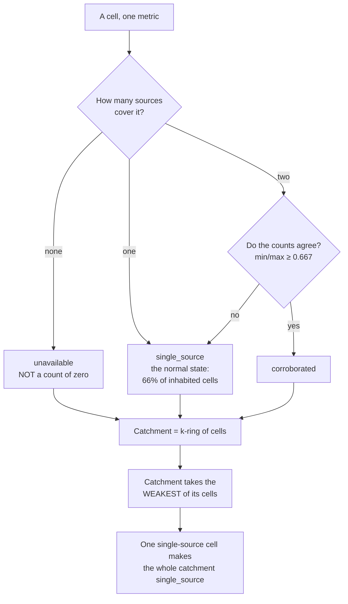
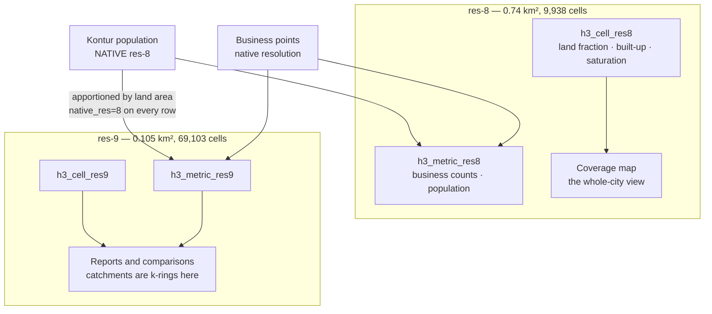

# Architecture

Four pieces, one direction of travel. Data is rebuilt monthly by a Python
pipeline into parquet, a Go API loads that parquet into RAM at startup, and a
React frontend renders what the API tells it — never recomputing a rule.

## The whole flow



`config/thresholds.json` is the single source for every tunable value. The API
**refuses to start** if one it needs is missing, rather than falling back to a
default that might not match what the pipeline used.

## Why there is no database

res-8 + res-9 is **79,041 cells**; `h3_metric` is **109,996 rows**. On disk the
four tables total **6.11 MB** compressed, about 142 MB resident.

The Go API loads them into maps keyed by H3 index at startup and serves every
request as a hash lookup plus a k-ring walk. No PostGIS, no DB server, no
hosting cost beyond the process itself.

**Radius queries are computed at read time** via k-ring rather than precomputed
per radius, so catchment sizes stay flexible. The one exception is
`h3_metric_history`, which stays on disk and is streamed per request — it is
1.2M rows and grows by a snapshot every month, so loading it whole would be the
one thing that did need a database.

Restart the API after a monthly pipeline run. There is no hot reload.

## The confidence model

Confidence is per **metric** per **cell** — never a property of a cell alone. A
single cell legitimately carries corroborated population, corroborated built
environment and single-source business data at the same time.



**Weakest-link is deliberate and must never become an average or a majority
vote.** Aggregating confidence upward would launder exactly the uncertainty the
study spent two weeks measuring: 84–86% of cells are single-source, so any
upward-averaging rule would report most of the city as better-evidenced than it
is.

Two caveats the model cannot fix, both surfaced on every report:

- **Corroborated does not mean independent.** Foursquare is itself an Overture
  contributor (17.1% / 10.6% / 1.3% of Overture records across three Cairo
  districts), so agreement is partially-overlapping feeds agreeing.
- **The tolerance is generous.** The median count-agreement ratio between the
  two sources is ~0.50 — they typically disagree by 2×.

## H3 aggregation



**Two resolutions, two jobs.** res-8 is the coverage layer: 9,938 cells is a
single 0.6 MB GeoJSON the map renders without a tile pipeline. res-9 is what
catchments are built from — fine enough that a 500 m k-ring approximates a
circle, where res-8 would be far too coarse.

**Population is measured at res-8 and apportioned to res-9 by land area**, and
every row says so via `native_res`. Kontur publishes on res-8 hexagons, so a
res-9 population figure cannot be observed, only estimated — the report card
states that rather than implying a reading at that scale.

The catchment `k` is chosen by **matching the ring's area to the requested
circle**, measured against the origin cell's own area, because a hexagon ring
and a circle can never coincide exactly. Both areas are returned so the
approximation is visible.

## Request path

```mermaid
sequenceDiagram
  participant U as Browser
  participant A as Go API
  participant S as In-memory store
  participant H as history parquet (on disk)

  U->>A: GET /api/report?lat&lon&k&category
  A->>A: lat/lon → H3 res-9 cell → k-ring
  A->>S: cell + metric lookups per ring cell
  S-->>A: values, confidence, sources, vintages
  A->>A: sum, normalise by LAND area, weakest-link
  A->>H: stream history rows for these cells
  H-->>A: series per snapshot
  A->>A: artifact detection on the AGGREGATE series
  A-->>U: metrics + series + limitations + notes
  Note over U: renders exactly what it was told;<br/>never recomputes a rule
```

## Where rules live

| rule | implemented in | reaches the frontend as |
|---|---|---|
| direction of good | Go | `direction_of_good` on each metric |
| weakest-link ordering | Go | `confidence_rank` (2/1/0) |
| saturation class | Go, from thresholds | `saturation_class` |
| growth materiality | Go, from thresholds | `growth_is_material` |
| artifact detection | Python + Go, params from one manifest | point `status` + `correction_status` |

If the frontend cannot render something without reimplementing a rule, the API
is not sending enough — the fix is to extend the response, never to duplicate
the rule.
